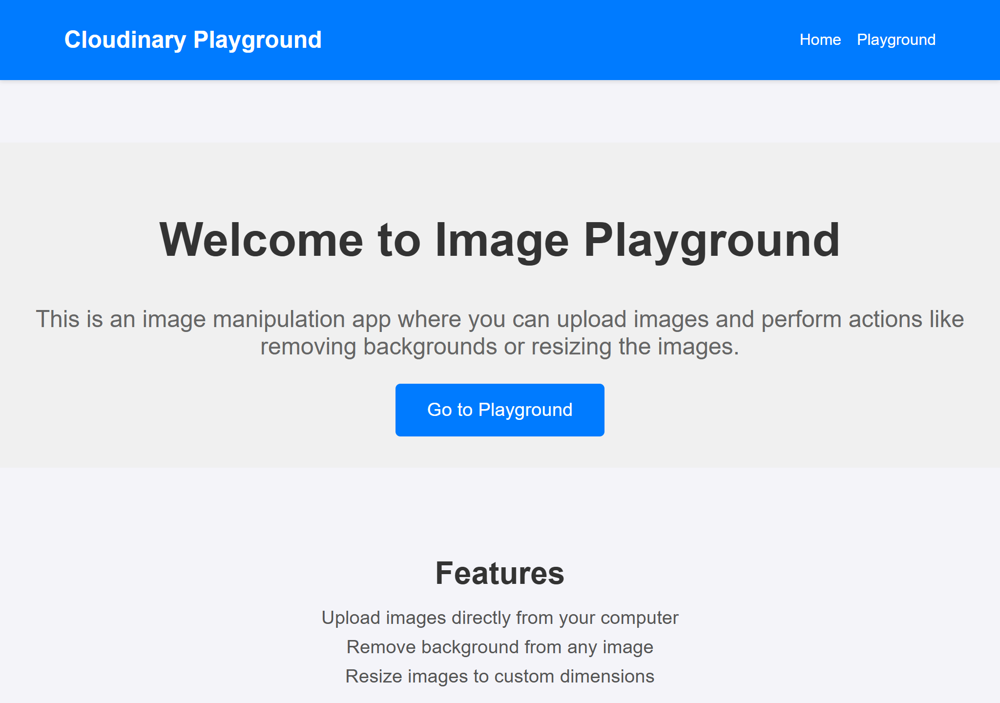
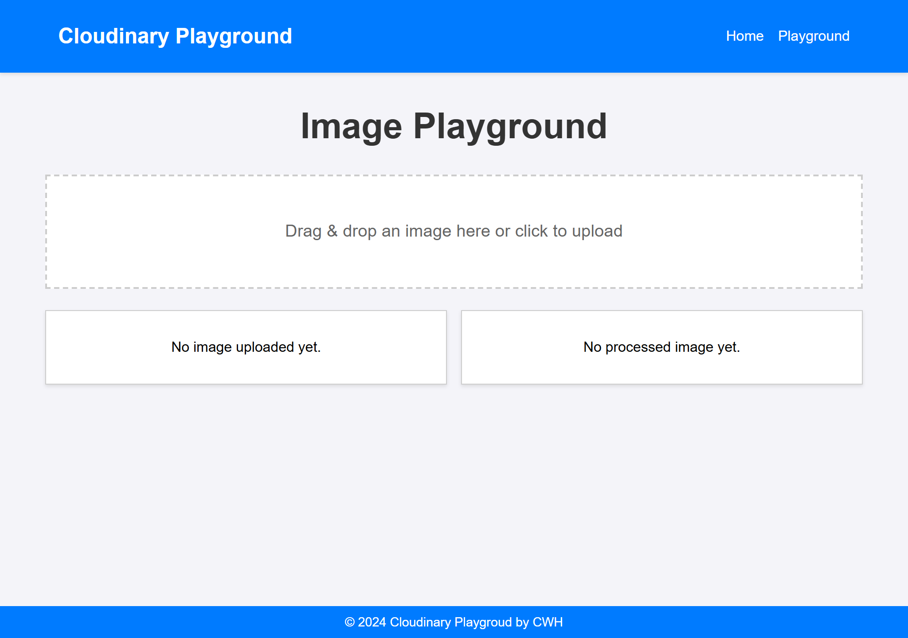
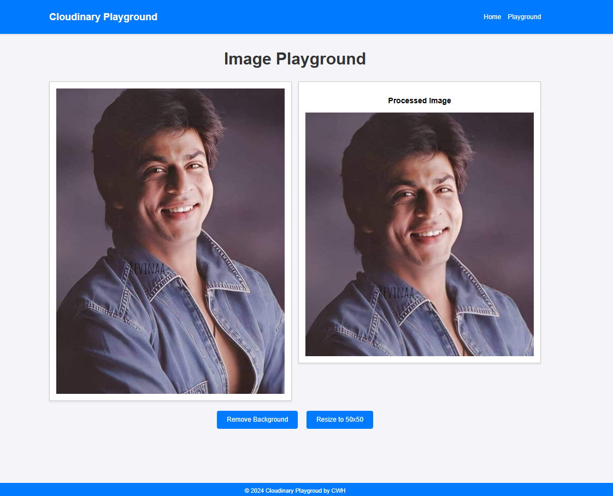

# Flask Cloudinary App

This project demonstrates a simple Flask application integrated with [Cloudinary](https://cloudinary.com/), allowing users to upload and manage media files (images, videos) via the Cloudinary service. The app has a clean and simple structure, with static and template directories for handling the front end, and Python scripts for backend integration.

## Features

- **Cloudinary Integration**: Upload images and videos to Cloudinary with ease.
- **Flask Framework**: Lightweight and fast web framework for Python.
- **Dynamic Media Display**: Uploaded media is displayed dynamically.
- **Responsive Design**: Designed with a focus on user experience and modern web standards.
  
## Getting Started

### Prerequisites

Before running this application, ensure you have the following installed:

- Python 3.x
- Flask
- Cloudinary SDK

### Installation

1. **Clone the Repository**

   ```bash
   git clone https://github.com/Niketangoyal/EnhanceImage.git
   cd EnhanceImage
   ```

2. **Install Dependencies**

   Install the required dependencies using pip:

   ```bash
   pip install -r requirements.txt
   ```

3. **Set up Cloudinary**

   Create a `config.py` file and configure your Cloudinary credentials:

   ```
    cloud_name="cloud_name",
    api_key="api_key",
    api_secret="api_secret",
    secure=True
   ```

### Running the App

To run the app locally:

```bash
python main.py
```

You can access the app in your browser at `http://127.0.0.1:5000/`.

### Folder Structure

```
flask-cloudinary-app/
│
├── static/               # Static files (CSS, JavaScript, Images)
├── templates/            # HTML templates
├── main.py               # Main application file
├── trycloudinary.py      # Cloudinary-related functionalities
├── config.py             # Cloudinary-related secrets
├── .gitignore
└── README.md             # Project documentation
```
## Usage

1. Open the app in your browser.
2. Upload an image or video file using the provided form.
3. The uploaded media will be sent to Cloudinary and displayed in the gallery.

## Technologies Used

- **Flask**: Web framework for Python.
- **Cloudinary**: Cloud-based media management service.
- **HTML/CSS/JavaScript**: Frontend technologies for designing the user interface.

### Screenshots






